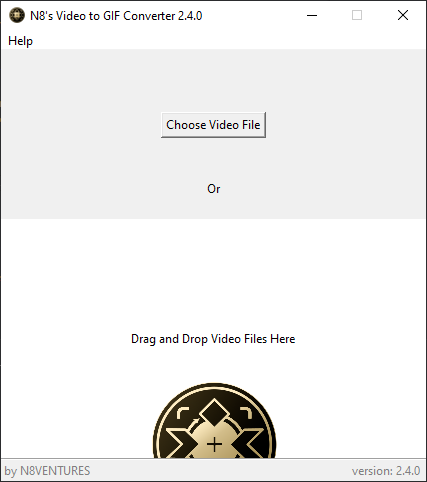
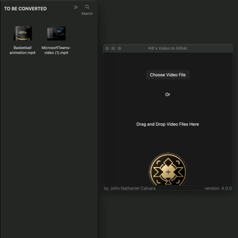
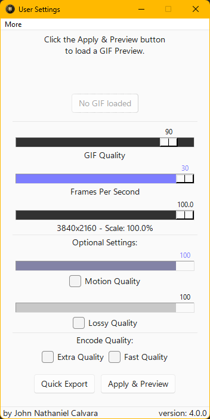
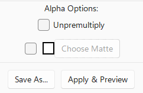
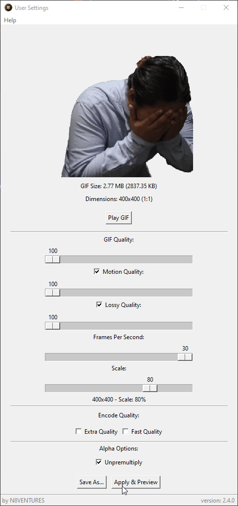
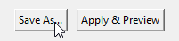
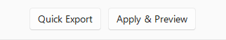

# Video to Gifski
Convert videos and export them into GIFs using Gifski.

# Releases
Stable release is available on Windows (x64) & MacOSX (Apple Silicon/ARM).

Download and check the latest release [here](https://github.com/n8ventures/video-to-gifski/releases/latest).

or just directly download here without worry:

[OSX (ARM/Apple Silicon)](https://github.com/n8ventures/video-to-gifski/releases/latest/download/MacOS.-.N8.Video.To.Gifski.dmg)

[Windows](https://github.com/n8ventures/video-to-gifski/releases/latest/download/N8sVideoToGifski.exe)

<h1>How To Use</h1>

### 1. Open up the program, either choose the "Choose File" Button, or drag the video on the window!

Since Version 4.0.0, you can batch-process multiple videos at once!

### 2. Choose your compression options
I'd like to point out that enabling/checking Motion Quality and/or Lossy Quality affects the overall quality.

Also, you'll also have this option pop up if it detects videos with alpha channels.

### 3. Preview the GIF
Click on the `Apply & Preview` button, to apply the settings you adjusted and a preview GIF should show along with the GIF Size and Dimensions.

If you don't like the current settings, you can always adjust it.

### 4. Save the GIF
Now just click the `Save As` button, and you're good to go.

But, let's backtrack a bit, remember on the first time the program opens the GIF, you see the `Quick Export` button? It's there if you just want something converted quick and done.

First instance of opening the video:

## Licenses

This software is distributed under the terms of the [MIT License](LICENSE).

Third-party components used in this software may have their own licenses. 
Please refer to the following for more information:

- [FFmpeg License](https://ffmpeg.org/legal.html)
- [GIFSKI License](https://gif.ski/license.html)
